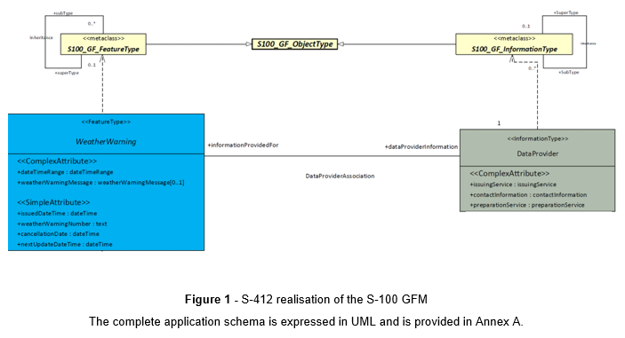

[[sec-data-content-and-structure]]
== Data Content and Structure

=== Introduction

This section describes the application schema, which is described in Unified Modelling Language (UML):

* Feature Catalogue; +
* Dataset types; +
* Geometry.

The Marine Weather Warnings Overlay is a feature-based vector product that contains meteorological and oceanographic datasets. The content information is described in terms of a Feneral Feature Model and a Feature Catalogue.

=== Application Schema

S-412 conforms to the General Feature Model (GFM) outlined in S-100 Part 3 and is realised in Figure 1. The GFM is the conceptual model for feature and information types.

[[fig-general-feature-model]]
.S-412 General Feature Model

*The complete application schema is expressed in UML and is provided in Annex A.*

The data model consists of seven classes, where six are feature types:

* *WeatherWarning*;
* *ThunderstormWarning*;
* *WindWarning*;
* *IceAccretionWarning*:
* *SignificantWaveHeightWarning*;
* *RestrictedVisibilityWarning*.

and one is an Information Type:

* *DataProvider*.

These feature types are derived from the S-100_GF_FeatureType metaclass. Feature and Information Type descriptions can be found in Annex A.

S-412 conforms to the General Feature Model (GFM) from S-100 Part 3. This document describes the Application Schema expressed in the UML diagram. This document contains only an overview of the S-412 application schema. The S-412 Application Schema types are realised in the Feature Catalogue. The Feature Catalogue can be found in the WMO Domain of the IHO Registry, and provides a full specification of all types including feature and information types, their attributes, allowed values, and the relationships between types in the data product.

The following conventions are used in the UML diagrams depicting the application schema:

*	Standard UML conventions for classes, associations, inheritance, roles, and multiplicities apply. These conventions are described in Part 1 of S-100. +
*	Italic font for a class name indicates an Abstract Class. +
*	Abstract Feature Classes are depicted with a blue background. +
*	Ordinary (non-abstract) feature classes are depicted with a green background. +
*	Information type classes are depicted with a grey background. There are no abstract information type classes in S-412. +
*	Association Classes are depicted with a white background. +
*	Complex attributes are depicted with a salmon background. +
*	Simple attributes use a purple background. +
*	Enumeration lists are depicted with a yellow background. The numeric code corresponding to each listed value is shown to its right following an ‘=’ sign. +
*	Codelists are depicted with an orange background. +
*	No significance is attached to the colour of associations. (Complex diagrams may use different colours to distinguish associations that cross one another.). +
*	Where the association role or name is not explicitly shown, the default rules for the roles and names apply: +
  ** The role name is ‘the<CLASSNAME>’ where <CLASSNAME> is the name of the class to which that association end is linked. +
  ** The association name is ‘<CLASSNAME1>_<CLASSNAME2>’ where <CLASSNAME1> is the source and <CLASSNAME2> the target. In the case of a feature/information association, the feature is the source. For feature/feature or information/information associations without explicit names, the source/target are indicated by an arrowhead. +
*	Subclasses inherit the attributes and associations of their superclasses at all levels, unless such inheritance is explicitly overridden in the subclass.

=== Feature Catalogue

==== Introduction

The S-412 Feature Catalogue describes real-world meteorological and oceanographic concepts in one or more sets of geographic data as Feature Types, Information Types, Attributes, Attribute Values, Associations and Roles. These are bound together in the .XML Feature Catalogue.

Definitions of each feature type, information type, attribute, including enumerated value definitions, and Associations are provided in the Data Classification and Encoding Guide (Annex A) and represent concepts that may be modelled in an S-412 dataset. These definitions are drawn from a Feature Concept Dictionary managed by the IHO through execution of the IHO Geospatial Information Registry . 

==== Feature Types

Feature types are the basic level of classification in the Feature Catalogue, and are used in S-412 to represent warnings of atmospheric and oceanographic phenomena.

[[fig-s412-features]]
.S-412 Features
image::../images/figure-s412-features.png[UML diagram depicting the S-412 Features]

===== [[s4_start_review1]]Meta Features[[s4_end_review1]]

Meta Features contain information about other features within a data set. Information defined by Meta Features override the default metadata values defined by the dataset descriptive records.

S-412 provides a single meta-feature, DataCoverage. DataCoverage is for describing areas in the dataset that are populated with data. The dataset may include multiple DataCoverage features to describe different contiguous (i.e. non-overlapping) areas.

[reviewer="IIC",date=2025-12-05,from=s4_start_review1,to=s4_end_review1]
****
If DataCoverage Meta Feature is not used in S-412, suggest replacing the text by: "_S-412 does not make use of any Meta Feature_".
****

===== Geographic Features

Geographic (geo) feature types form the principal content in S-412 and are fully defined by their associated attributes and Information Types.

feature types may be associated to other feature types or to Information Types.

As an example, the realisation of a Wind Warning concept is provided by an UML diagram in Figure 2. The diagram shows the Wind Warning feature’s inheritance from the abstract Weather Warning feature and its connection to various complex and simple attributes. The windWarningThreshold attribute is used to determine the category and [[s4_start_review2]]portrayal[[s4_end_review2]] colour of Wind Warning polygons based on wind speeds. The optional beaufortForce attribute is used to indicate more specific wind speed bins that the feature represents, based on the Beaufort Wind Scale. The dateTimeRange attribute provides the start and end times that are valid for the Wind Warning. The weatherWarningNumber attribute provides an identification number to track warnings issued with each new dataset. The optional weatherWarningMessage attribute provides a short message with added context or information about a Weather Warning.

[reviewer="IIC",date=2025-12-05,from=s4_start_review2,to=s4_end_review2]
****
The colour is determined by the Portrayal Catalogue (based on the attribute value).
****

[[fig-wind-warning-feature]]
.Wind Warning Feature
image::../images/S-412-Wind Warning.png[UML diagram depicting the S-412 Wind Warning Feature with its attributes and associations.]

==== Information Types

Information Types define identifiable pieces of information in a dataset that can be shared between other features or information types. Information Types have attributes but have no relationship to any geometry; Information Types may reference other information types.

Figure 3 shows the realisation of the single Information Type used in S-412: *DataProvider*.

[[fig-data-provider-information-type]]
.Data Provider Information Type
image::../images/S-412 Information Types.png[UML diagram depicting the S-412 Data Provider Information Type.]

==== Feature Relationship

A feature relationship links one or more instances of one feature type with one or more instances of the same or a different feature type. There are three common types of feature relationships: Association, Aggregation, and Composition.

Associations are described in more detail in section 4.3.6. An Aggregation Association is a relationship between two classes, in which one of the classes plays the role of container and the other plays the role of a containee. The Aggregation Association shall be used when the containee objects (that represent the parts of a container object) can exist without the container object.

A Composition Association is a strong aggregation, where the containee object cannot exist without the container object. If a container object is deleted then all of its containee objects are deleted as well. 

==== Attributes

Attributes define the characteristics of a Feature or Information Type. Attribute Types can be either complex or simple. Simple attributes carry the value itself, and complex attributes are aggregations of other simple and/or complex attributes that create a hierarchical data structure to describe a feature. Unlike Information Types, an attribute instance belongs to one and only one Feature or Information Type.

===== [[s4_start_review3]]Simple attributes[[s4_end_review3]]

The following table lists the types of simple attributes used in S-412.

[reviewer="IIC",date=2025-12-04,from=s4_start_review3,to=s4_end_review3]
****
TBC that attributes of type real and integer are used in S-412
****

[cols="a,a",options="headers"]
|===
|Type |Definition 

|enumeration
|List of predetermined values that can be expanded and contracted.

|real
|A floating point number.

|integer
|Numeric value with defined range, units and format.

|text
|A sequence of characters.

|dateTime
|Character encoding shall follow the format for date and time as specified in ISO 8601. +
Example: 19850412T101530.

|boolean
|True or False.

|URN
|Uniform Resource Name.

|===

Simple attributes for the Wind Warning feature type are shown in Figure 2 and the DataProvider Information Type in Figure 3. Each attribute type is listed next to their camel case encoding value. Enumerated attributes are referenced by their defined data type and values are listed. Enumerated attributes, represented in UML are shown in Figure 4. The complete list of all attributes and their properties approved for use in S-412 are provided in Annex A.

[[fig-s412-enumerated-attributes]]
.S-412 Enumerated Attributes
image::../images/figure-s412-enumerated-attributes.png[UML diagram depicting the S-412 Enumerated Attributes.]

===== Code Lists

Within S-100, Codelist types may be used for open enumerations whose membership cannot be known at the level of the product specification, for reuse of information model fragments, or for more efficient catalogue management. 

Codelist Types are not utilised in this version of S-412.

===== Complex Attributes

Complex attributes are aggregations of other attributes that are either simple or complex. The aggregation is defined by means of attribute bindings. Figure 5 shows the complex attribute dateTimeRange utilised by many features, including the Wind Warning feature type shown in Figure 2. This attribute is an aggregation of 2 simple dateTime attributes. A full list of complex attributes approved for use in an S-412 dataset are defined in Annex A as well as represented in UML in Figure 6.

[[fig-s412-complex-attributes]]
.S-412 Complex Attributes
image::../images/figure-s412-complex-attributes.png[UML diagram depicting the S-412 Complex Attributes.]

==== Associations

Associations are used to describe a relationship between instances of one feature or information type with instances of the same or a different feature or information type. Unless otherwise noted, associations are bi-directional in S-412. If an association is unidirectional, source and target roles are defined.

Figure 7 shows an example of the association between the WeatherWarning feature type and the DataProvider information type called DataProviderAssociation. The real world relationship between these concepts is that a weather warning has additional information about the service(s) issuing the warning.

[[fig-s412-data-provider-association]]
.S-412 Data Provider Association
image::../images/figure-s412-data-provider-association.png[UML diagram depicting the S-412 Data Provider Association between a Weather Warning and a Data Provider.]

Figure 6 shows the real world relationship between a weather warning and its supplemental information for where it came from. A complete list of associations and roles used in S-412 can be found in Annex A.

===== Camel Case Rules

All names in S-412 are unique in order to distinguish one from another. Further, camel case rules are applied in order to distinguish encoding values. Each class, package, type-specification and association name are concatenated and start with an uppercase letter with each subsequent word starting with a capital letter. Attribute and association role names are concatenated and start with a lower-case letter; subsequent words start with a capital letter.

Example: The Wind Warning feature type is encoded as WindWarning. The Date Time Range complex attribute type is encoded as dateTimeRange.

==== Multiplicity Rules

In UML, all attributes are mandatory by default. Multiplicity rules are used for attributes and association role names to provide a way of describing optional and conditional attributes. In these rules, the first number represents the minimum number of instances that may exist; the second number represents the maximum number of instances that may exist. For example, 0..* means many, optional, zero or more; 1..* means at least one.

==== Inheritance

A hierarchical structure among S-412 feature types and Information Types exists in order to group similar concepts by definition, use cases or attribute sets. The base level of the hierarchy is commonly called the Super-type and represents a generic concept. More specific concepts are the next level in the hierarchy and these are called Sub-types. All Sub-types inherit the properties of the Super-type within the same hierarchical structure unless otherwise specified. Within S-412, inheritance creates flexibility for a data producer to utilise the appropriate feature based on their user’s needs.

In the WindWarning feature shown in Figure 2, WindWarning inherits all attributes and associations from the WeatherWarning abstract feature type.

==== Spatial Quality

Spatial quality attributes are commonly carried by S-100 based product specifications in an information class called Spatial Quality and describe the positional quality of an object. Because S-412 datasets are assumed to be composed of the highest quality position data available at the time of issuance, Spatial Quality is not utilised in S-412 Product Specification.

==== Temporal Quality

There is a direct relationship between temporal quality and spatial quality with S-412 datasets. Because S-412 datasets are assumed to be composed of the highest quality position data available at the time of issuance, it is necessary to ensure the temporal quality of the dataset. Temporal quality ensures spatial quality.

Various time attributes are carried by various features to ensure the end user is aware of when the dataset is published as well as when the data is valid. Together, these attributes in the data ensure the user is aware of the temporal quality of the data.

Additionally, other time attributes are included to validate time across a dataset. For example, the issuedDateTime carried by Weather Warning is also carried by Wind Warning. If these two attributes are not the same, the dataset should not validate. Each category of Weather Warnings (Wind, Significant Wave Height, Thunderstorm, etc) also has dateTimeRange attributes showing the start and end times for the warning periods. These measures are included to ensure the most current and spatially accurate datasets are available to the end user. Further information on these validation measures can be found in Annex F. Additional time attributes such as cancellationDate and nextUpdateDateTime are discussed in section 4.4.2.

=== Dataset Types

==== Introduction

A dataset is a grouping of features, attributes, geometry, and metadata which comprises a specific geographic coverage. Only one type of S-412 dataset is supported: 1) GML encoding for surface geometric primitive feature collections.

==== Time

S-412 datasets can represent real-world phenomena in the present or future. Because of the unique nature of atmospheric and oceanographic concepts and their geographical changes in time, a variety of time attributes are included in S-412 to ensure instances of features are attributed correctly through time. Features or information types outside of the temporal range of a dataset shall not be included in a dataset. Time shall always be provided in Coordinated Universal Time (UTC).

The dateTimeRange is a complex attribute consisting of simple attributes, dateTimeStart and dateTimeEnd, to allow certain features to define a specific temporal range. The dateTimeRange attribute is mandatory for each feature. This attribute provides data producers the flexibility to manage the temporal resolution of their datasets at the feature level and to concatenate data files in a manner which best suits their workflow and customer’s needs. In order for features to be portrayed, the user’s system must clearly indicate the dateTimeRange of a feature or a group of features if the values are the same. Instances of this attribute may be used for data validation and to ensure temporal quality.

Three other simple dateTime attributes (issuedDateTime, nextUpdateDateTime, and cancellationDate) are mandatory for each WeatherWarning and inherited into the sub-feature types. The issuedDateTime attribute provides a timestamp for when the WeatherWarning has been issued. The nextUpdateDateTime attribute provides the time information for the next expected WeatherWarning to be issued. The cancellationDate {is used to mark when a WeatherWarning is set to expire, or be cancelled}. More information about cancellationDate can be found in section {insert section}.

Every time attribute is associated with the abstract WeatherWarning feature type. These attributes are inherited by all sub-types of WeatherWarning (windWarning, significantWaveHeightWarning, iceAccretionWarning, restrictedVisibilityWarning, and thunderstormWarning). This is demonstrated in Figure 7.

[[fig-time-attributes-associated-with-weather-warning]]
.S-412 weatherWarning Time Attributes
image::../images/figure-time-attributes-associated-with-weather-warning.png[UML diagram depicting the S-412 Time attributes associated with weatherWarnings.]

==== Multiple datasets

In order to facilitate the efficient processing and exchange of S-412 data, S-412 data files will be split by the time and date in which the file’s data is valid.

==== Units of Measurement

Weather Warnings represent different types of phenomena, and thresholds categorize the severity of the warnings. Enumerated attributes are used to describe the thresholds for many weatherWarning sub-types including; windWarning, significantWaveHeightWarning, and iceAccretionWarning. For restrictedVisibility and thunderstormWarning feature types, units are determined at the feature level. More information about the units in each category are located in the definitions of each feature.

=== Geometry

S-412 supports simple geometry that can be expressed in multiple configurations as described in ISO 19107:2003 clause 6.1.3. Only surface geometries represent S-412 features.

==== S-100 Level 3a Geometry

The underlying geometry of an S-412 dataset is constrained to level 3a which supports 0, 1 and 2 geometric dimensional objects (points, curves and surfaces) as defined by S-100 Part 7 – Spatial Schema. This product specification uses only one type of geometry: GM_Polygon (GM_Surface).

Level 3a is described by the following constraints:

* Each curve must reference a start and end point (they may be the same).
*	Curves must not self-intersect. See Figure 9
*	Areas are represented by a closed loop of curves beginning and ending at a common point.
*	In the case of areas with holes, all internal boundaries must be completely contained within the external boundary and the internal boundaries must not intersect each other or the external boundary. Internal boundaries may touch tangentially (i.e. at one point). See Figure 9.
*	The outer boundary of a surface must be in a clockwise direction (surface to the right of the curve) and the curve orientation positive. The inner boundary of a surface must be in a counter-clockwise direction (surface to the right of the curve) and the curve orientation negative. See Figure 9.

[[fig-level-3a-geometric-rules]]
.Level3a Geometric Rules
image::../images/figure-level-3a-geometric-rules.png[UML diagram depicting the Level 3a Geometric Rules.]

S-412 further constraints Level 3a with the following:
*	Coincident linear geometry must be avoided when there is a dependency between features. 
*	Curve interpolation may be utilised to represent a variety of curve types. Curve interpolation may also be utilised for inner and outer boundaries for polygons. 
*	With the exception of curved interpolations, all multi-geometries must be split into single geometries.
*	Curves, including interpolations, and areas should avoid crossing the 180° longitude.

Examples illustrating the variety of ways geometry may be represented in an S-412 GML data file are provided in Annex E.

==== Feature Types Summary

. Summary of implemented features
[width=50%,cols="1,1,5",options="headers"]
|===
|Index |Alias |Name

|Feature
|Weather Warning
|Weather Warning

|===
