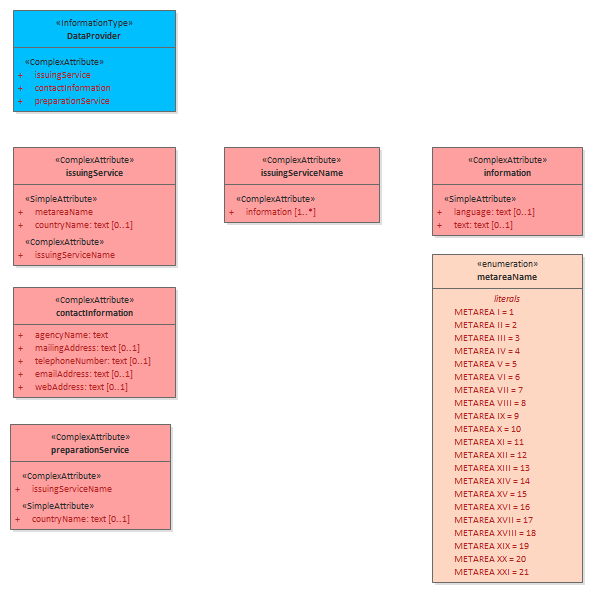
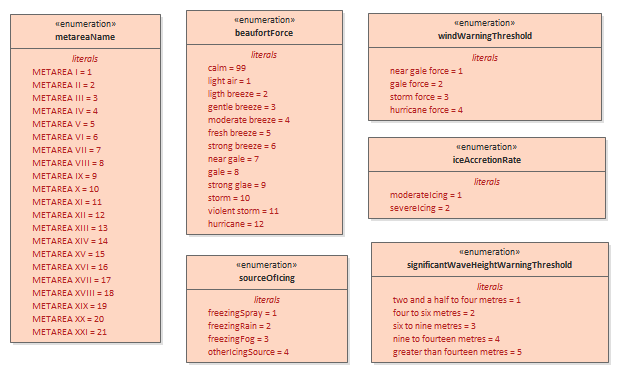

[[sec-data-content-and-structure]]
== Data Content and Structure

=== Introduction

The S-411 product is based on the S-100 General Feature Model (GFM), and is a feature-based vector product. Figure 4.1 shows how the S-411 application schema is realised from the S-100 GFM. All S-411 feature classes are derived from the abstract class FeatureType defined in the S-411 application schema, which realize the GFM meta-classes S100_GF_FeatureType.

The application schema of Ice Information product contains 28 feature types with their attributes, enumerations etc. It is based on the ice objects catalogue (Version 5.3) and can also be found in the ICE domain of the IHO Registry. Because of this it is not possible to describe the full schema in suitable form in this specification. More information can be found as XML Schema File in Annex B – Data Product format (encoding).

=== Application Schema

S-411 conforms to the General Feature Model (GFM) from S-100 Part 3. The GFM is the conceptual model and the 
implementation is defined in the Feature Catalogue which is included as a separate Annex (Annex C) and provides a full specification of all types including feature types, their attributes, allowed and values. The S-411 Product Specification only contains specific examples.

The following conventions are used in the UML diagrams depicting the application schema:

* Standard UML conventions for classes, associations, inheritance, roles, and multiplicities apply. These conventions are described in Part 1 of S-100.

* Italic font for a class name indicates an abstract class.

* Feature classes are depicted with green background; the dark shade for abstract feature classes and the light shade for ordinary (non-abstract) feature classes.

* Complex attributes are depicted with a pink background.

* Enumeration lists and codelists are depicted with a tan background. The numeric code corresponding to each listed value is shown to its right following an ‘=’ sign.

==== Domain model
The S-411 domain model has one base class (‘root class’) from which all the domain-specific geographic features type classes are derived. The base class is shown in the figure below. The base class for geographic features is FeatureType which has a set of attributes which are therefore inherited by all domain-specific features. The approximate area features in S-411 are also derived from the geographic feature root class. Base classes are abstract classes and do not have direct instances in S-411 data – instead, S-411 feature type data objects are instantiations of all non-abstract classes.

S-411 meta-features are also derived from the base class – S-411 incorporates meta-feature definitions originally prepared for S-101 in the interests of harmonization and interoperability with other S-100-based data products, especially S-101 ENCs.

==== S-411 Features

===== Meta Features
S-411 provides a single meta-feature, *DataCoverage*. *DataCoverage* is for describing areas in the dataset that are populated with data. The dataset may include multiple *DataCoverage* features to describe different contiguous (i.e. non-overlapping) areas.

[[fig-the-data-coverage]]
.*Data Coverage*

===== Geographic Features

Geographic (geo) feature types form the principal content of the S-411 product and are fully defined by their associated attributes.

The following figure shows all the major ice features and a simplified view of their attributes in the S-411 Application Schema. The abstract Ice class is introduced to simplify the UML model of the features.

[[fig-all-ice-features]]
.*All Ice Features*
image::../images/figure-all-ice-features.png[Diagram showing all ice features]

The ice features contains a number of attributes defined as enumerations. The following diagram shows the main ice (surface) feature classes complete with the details of these enumerations and their values.
[[fig-all-ice-features-wenums]]
.*Detailed Ice Features*

All Limit and Line curve features and their attributes are shown in the following diagram
[[fig-all-curve-features]]
.*All Curve Features*
image::../images/figure-all-curve-features.png[Diagram showing all ice features]

There are a number of point features shown in the following diagrams
[[fig-point-features1]]
.*Point Features*
image::../images/PointFeatures1.png[Point Features]

[[fig-point-features2]]
.*Point Features*
image::../images/PointFeatures2.png[Point Features]

[[fig-point-features3]]
.*Point Features*
image::../images/PointFeatures3.png[Point Features]

[[fig-point-features4]]
.*Point Features*
image::../images/PointFeatures4.png[Point Features]

Full details of all geographic feature types can be found in Annex A – Data Classification and Encoding Guide, clause 2.1 and Sections 4-22.

==== Attributes

S-411 defines attributes as either simple or complex in line with the S-100 GFM.

===== Simple attributes

S-411 uses 3 types of simple attributes; these types are listed in Annex A – Data Classification and Encoding Guide, clause 2.4.2. Descriptions of the simple attributes included in S-411 can be found in Annex A, Sections 27, 28 and 30.

===== Complex attributes

Complex attributes are aggregations of other attributes that are either simple or complex. The aggregation is defined by means of attribute bindings. Examples of modelling complex attributes can be found in S-100 Part 2a, Appendix 2a-A. Descriptions of the complex attributes included in S-411 can be found in Annex A – Data Classification and Encoding Guide

=== Feature Catalogue

==== Introduction

The S-411 Feature Catalogue describes the feature types, attributes and attribute values which may be used in an S-411 product.

The S-411 Feature Catalogue is available as an XML document which conforms to the S-100 XML Feature Catalogue Schema and can be downloaded from the IHO website (https://registry.iho.int/). S-411 Annex A – Data Classification and Encoding Guide, constitutes a human readable interpretation of the Feature Catalogue along with information on how features should be encoded.

The feature Catalogue for Ice Information contains only geographic and meta features. The ice features which can be used in ECDIS are defined within the ICE domain of the IHO Registry.

==== Feature types

Feature types contain descriptive attributes that characterize real-world entities. The word ‘feature’ may be used in one of two senses – feature type and feature instance. A feature type is a class and is defined in a Feature Catalogue. A feature instance is a single occurrence of the feature type and represented as an object in a dataset. A feature instance is located by a relationship to one or more spatial instances. A feature instance may exist without referencing a spatial instance.

==== Geographic

Geographic (geo) feature types carry the descriptive characteristics of a real-world entity (a location or place on the surface of the Earth). In the context of Ice Information products, this comprises most of the features (with the exception of DataCoverage) and represents those features with a real-world existence.

==== Meta

Only one metadata feature is defined, DataCoverage. This defines the area of coverage bounded by the dataset, and any features within it. DataCoverage contains a mandatory optimumDisplayScale attribute and two optional maximum, and minimum display scale attributes.

[[fig-data-coverage]]
.*Data Coverage*

==== Attributes

S-411 defines attributes as either simple or complex in line with the S-100 GFM.

===== Simple attributes

S-411 uses three types of simple attributes; they are listed in the following Table:

[cols="a,a",options="headers"]
|===
|Type |Definition 

|Integer
|An integer number.

|Real
|A floating point number.

|Enumeration
|One or more of a list of predefined values.

|===

==== Application Schema implementation

===== Implementation description

===== Ice DataSets

Ice Data Sets contains an unlimited number of Ice Features, for example (SeaIce, LakeIce, Iceberg, etc.).

==== Feature Types Summary

. Summary of Types in the WMO Ice Domain Register
[width=50%,cols="1,1,5",options="headers"]
|===
|Index |Alias |Name

|Feature
|SEAICE
|Sea Ice

|Feature
|LACICE
|Lake Ice

|Feature
|BRGARE
|Iceberg Area

|Feature
|ICELNE
|Ice Edge

|Feature
|BRGLNE
|Iceberg Limit

|Feature
|OPNLNE
|Limit of Open Water

|Feature
|LKILNE
|Limit of All Known Ice

|Feature
|I_RIDG
|Line of Ice Ridge

|Feature
|I_LEAD
|Line of Ice Lead

|Feature
|I_FRAL
|Line of Ice Fracture

|Feature
|I_CRAC
|Line of Ice Crack

|Feature
|ICECOM
|Ice Compacting

|Feature
|ICELEA
|Ice Lead

|Feature
|ICEBRG
|Iceberg

|Feature
|FLOBRG
|Floeberg

|Feature
|ICETHK
|Ice Thickness

|Feature
|ICESHR
|Ice Shear

|Feature
|ICEDIV
|Ice Divergence

|Feature
|ICERDG
|Ice Ridge/Hummock

|Feature
|ICEKEL
|Ice Keel/Bummock

|Feature
|ICEDFT
|Ice Drift

|Feature
|ICEFRA
|Ice Fracture

|Feature
|ICERFT
|Ice Rafting

|Feature
|JMDBRR
|Jammed Brash Barrier

|Feature
|STGMLT
|Stage of Melt

|Feature
|SNWCVR
|Snow Cover

|Feature
|STRPTC
|Strips and Patches

|Feature
|I_GRHM
|Grounded Hummock

|Attribute
|ICEACT
|Total Concentration

|Attribute
|ICEAPC
|Partial Concentration

|Attribute
|ICESOD
|Ice Stage of Development

|Attribute
|ICELSO
|Lake Ice Stage of Development

|Attribute
|ICEFLZ
|Floe Sizes

|Attribute
|ICEMLT
|Melt Stage

|Attribute
|ICESPC
|Concentration of Strips and Patches

|Attribute
|ICEBNM
|Number of Icebergs in Area

|Attribute
|ICELVL
|Level Ice

|Attribute
|ICECST
|Compacting Strength

|Attribute
|ICEFTY
|Ice Fracture Type

|Attribute
|ICELST
|Ice Lead Status

|Attribute
|ICELFQ
|Frequency of Leads or Fractures

|Attribute
|ICELOR
|Orientation of Leads or Fractures

|Attribute
|ICELWD
|Ice Lead (or Fracture or Crack) Width

|Attribute
|ICELOC
|Ice Location Information

|Attribute
|ICEBSZ
|Iceberg Size

|Attribute
|ICEDDR
|Ice Drift Direction

|Attribute
|ICEDSP
|Ice Drift Speed

|Attribute
|ICETCK
|Ice Average Thickness

|Attribute
|ICEMAX
|Maximum Ice Thickness

|Attribute
|ICEMIN
|Minimum Ice Thickness

|Attribute
|ICETTY
|Ice Thickness Type

|Attribute
|ICESCT
|Snow Depth

|Attribute
|ICESCN
|Snow Cover Concentration

|Attribute
|ICEDOS
|Direction Of Sastrugi

|Attribute
|ICERCN
|Ice Ridge Concentration

|Attribute
|ICERDV
|Ice Ridge Classification

|Attribute
|ICERMH
|Ice Ridge Mean Height

|Attribute
|ICERFQ
|Ice Ridge Frequency

|Attribute
|ICERXH
|Ice Ridge Maximum Height

|Attribute
|ICEKCN
|Ice Keel Concentration

|Attribute
|ICEKFQ
|Ice Keel Frequency

|Attribute
|ICEKMD
|Ice Keel Mean Depth

|Attribute
|ICEKXD
|Ice Keel Maximum Depth

|Attribute
|ICEFCN
|Ice Rafting Concentration

|Attribute
|IA_SFA
|Ice Stage of Development and Floe Size for the 1st p.c.

|Attribute
|IA_SFB
|Ice Stage of Development and Floe Size for the 2nd p.c.

|Attribute
|IA_SFC 
|Ice Stage of Development and Floe Size for the 3rd p.c.

|Attribute
|IA_FFA
|Ice Breccia for the 1st partial concentration

|Attribute
|ICEFCN
|Ice Breccia for the 2nd partial concentration

|Attribute
|IA_FFC
|Ice Breccia for the 3rd partial concentration

|Attribute
|IA_SNG
|Snow concentration

|Attribute
|IA_MLT
|Stage of melting

|Attribute
|IA_PLG
|Contamination

|Attribute
|IA_HLG
|Hills concentration

|Attribute
|IA_DUG
|Fractures concentration

|Attribute
|IA_BCN
|Icebergs concentration

|Attribute
|IA_BFM
|Prevailing iceberg form

|Attribute
|IA_BUH
|Max. height of the above-water part (iceberg / grounded hummock)

|Attribute
|IA_OBN
|Number of ice objects

|Attribute
|IA_DXW
|Max. width of ice lead (or fracture or crack)

|Attribute
|IA_DMW
|Min. width of ice lead (or fracture or crack)

|Attribute
|ICEBRS
|Brash Ice

|===
