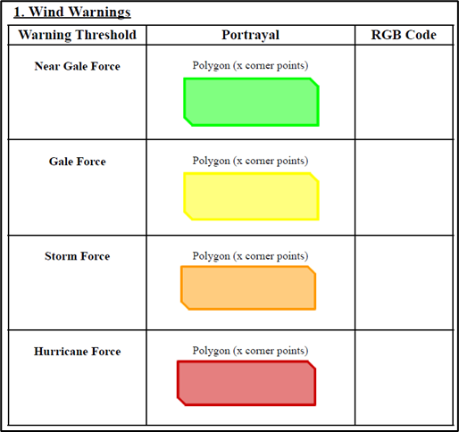
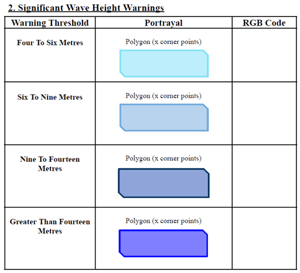
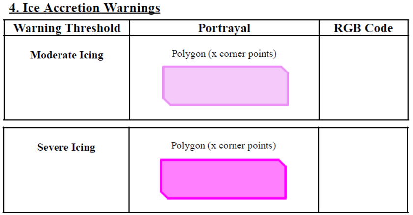
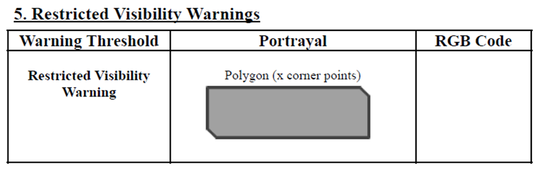

[[sec-portrayal]]
== Portrayal

=== Introduction

S-412 portrayal is intended to contribute to the safe operation of an S-100 based system by:

* 	Ensuring base and supplementary levels of display for S-412 data; standards of symbols, colours and their standardised assignment to features; scale limitations of data presentation;

* 	Ensuring the display is clear and unambiguous;

* 	Establishing an accepted pattern presentation that becomes familiar to mariners and so can be recognized instantly without confusion;

* 	Utilising the S-100 portrayal model to ensure interoperability.

S-412 portrayal is covered using the portrayal model as defined in S-100. This model reflects how the Portrayal Catalogue is defined for use in systems. The Portrayal Catalogue defines all symbology and the portrayal rules for each feature attribute combination contained in the Feature Catalogue.

S-412 uses the portrayal process defined in S-100 Part 9A.

Items included in an S-412 Portrayal Catalogue must be registered in the IHO Geospatial Information (GI) Registry.

The S-412 feature catalogue defines all features requiring portrayal and their geometric primitives. Currently S-412 only defines features which have a Polygon ("Surface" in S-100 terms) geometry. These are encoded using GML Polyons.

=== Polygon Features

Polygon portrayal may be based on values of particular attributes of the individual warnings. Where defined, the attributes which control the portrayal are as follows:

==== Controlling attributes

[cols="a,a",options="unnumbered"]
|===
h| Feature Name h| Attribute Name
| Wind Warning | Warning Threshold
| Significant Wave Height Warning      | Significant Wave Height Warning Threshold
| Ice Accretion Warning | Ice Accretion Rate
| Thunderstorm Warning | No conditional portrayal
| Restricted Visbility Warning | No conditional portrayal
|===

=== Example portrayal

All polygons are filled with transparent colours taken from the portrayal catalogue pallette. Examples are given in the following diagrams:

[[fig-s412-portrayal-WW]]
. Wind Warning Portrayal

[[fig-s412-portrayal-SWH]]
.Significant Wave Height Warning Portrayal

[[fig-s412-portrayal-IA]]
.Ice Accretion Portrayal

[[fig-s412-portrayal-TW]]
.Thunderstorm Warnings Portrayal

[[fig-s412-portrayal-RV]]
.Restricted Visibility Portrayal

No portrayal is implemented for any associated data provider features, nor for date-dependent features.

==== Portrayal Catalogue

The portrayal catalogue contains the mechanisms for the system to portray information found in S-412 datasets. The portrayal catalogue contains the following types of mechanisms and structures:

* 	Product Input Schema
* 	Set of portrayal rules
* 	Set of drawing instructions
* 	Set of symbols, line styles and colours

The portrayal catalogue model is defined in S-100 Part 9. The S-412 Portrayal catalogue is provided in Annex G and will be available in an XML document which conforms to the S-100 XML Portrayal catalogue Schema. It is structured as follows:

* Root ---- (contains the catalogue named “portrayal_catalogue.xml”)
* Pixmaps (contains XML files describing pixmaps)
* ColorProfiles (contains XML files with colour profiles and CSS2 style sheets)
* Symbols (contains SVG files with symbols)
* LineStyles (contains XML files with line styles)
* AreaFills (contains XML files area fills)
* Fonts (contains TrueType font files)
* Rules (contains XSLT files with templates)

==== Lua vs XSLT Portrayal

The current portrayal catalogue uses XSLT mechanisms which are capable of dealing with the conditional area fills as required. Should more complex portrayal be required then a LUA based mechanism may be employed in the future.
