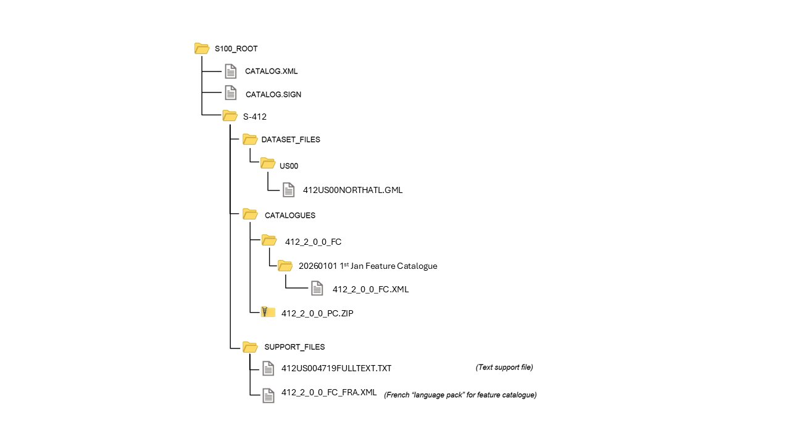

[[sec_11]]
[[sec-data-product-delivery]]
== Data Product Delivery

Data which conforms to this Product Specification must be delivered
by means of an Exchange Set.

[[sec_11.1]]
=== Exchange set components

S-412 uses the same exchange set components and metadata as S-100.
<<fig_11.1>> depicts the exchange set components (datasets and feature/portrayal
catalogues) and exchange set metadata. This figure is derived from
Figure 17-2 in S-100 Edition 5.2.0. Note also that the link between
S100_Dataset and S100_CatalogueMetadata is implicit by means of the
S-412 version to which the feature catalogue, portrayal catalogue,
and dataset conform, which must have the same edition and revision
components.

[[fig_11.1]]
.Components and associated metadata for the S-412 exchange set (S-100 Figure 17-2)
image::../images/S-412-ExchangeSet.png[]

The rules governing the presence and roles of the exchange set components
depicted in <<fig_11.1>> are given below.

. Every exchange set must contain an Exchange Catalogue, represented
by *S100_ExchangeCatalogue* in <<fig_11.1>>.
. Dataset discovery metadata (*S100_DatasetDiscoveryMetadata*) must
be provided in the exchange catalogue for each S-412 dataset in the
exchange set.
. Catalogue metadata (*S100_CatalogueDiscoveryMetadata*) must be provided
in the exchange catalogue for any feature and portrayal catalogues
included in the exchange set.
. S-412 allows exchange sets to include the following types of support
files:

.. Plain text support files referenced by datasets (*S100_SupportFile*).
.. Language packs (*S100_SupportFile*).
. Plain text support files referenced in a dataset must be included
in the exchange set.
. The inclusion of language packs in exchange
sets is optional.
. Language packs are described in S-100 Part 18 and provide translations
of feature catalogues.
. A signature file for the exchange catalogue must also be included
in the exchange set (*S100_CatalogueSignature*).

The tangible representations of the structure classes in <<fig_11.1>>
within actual exchange sets are the digital files or folders containing
the exchange set, dataset(s), catalogue(s), and support files.
The tangible representations of their roles as depicted in <<fig_11.1>>
are the inclusion of the respective components within the exchange
set. Documentation tables for the structure classes are not provided
since the exchange set structure is described in this clause.

The metadata classes in <<fig_11.1>> are represented by XML files
or XML blocks and are documented in <<sec_12.2>>.

Each Exchange Set consists of one or more S-412 datasets and a single Exchange Catalogue XML file containing
metadata. It may also include one or more support files (or no support
files). The Exchange Set structure is the same as that described in
S-100 Clause 17-4.2.

[[sec_11.2]]
=== Encapsulation

Each dataset must be contained in a physically separate, uniquely
identified file on the transfer medium.

An Exchange Set is encapsulated into a form suitable for transmission
as packages (such as ZIP archives or files organised within a file
system folder/directory structure), containing both the exchange catalogue
and one or more data products (of possibly different S-100 types),
with each product covering a specific geographic region and specific
period of time.

The contents of an Exchange Set are :

* Mandatory elements
** Exchange Catalogue -- the XML encoded description of the content
of the Exchange Set (discovery metadata).

* Optional elements
** S-412 datasets -- Since it is possible for an exchange set to contain
only a feature or portrayal catalogue, or only a support file which
is being updated or delivered as a new file, datasets are an optional
component of S-412 exchange sets.
** Supplementary files -- These are contained within the Exchange
Set as files. If the exchange set contains a dataset, the support
files referenced in the dataset must be included.
** S-412 Feature Catalogue -- If it is necessary to deliver the latest
Feature Catalogue to the end user it may be done using the S-412 Exchange
Set mechanism for datasets.
** S-412 Portrayal Catalogue -- If it is necessary to deliver the
latest Portrayal Catalogue to the end user it may be done using the
S-412 Exchange Set mechanism for datasets.

[[sec_11.3]]
=== Dataset

[[sec_11.3.1]]
==== Types of Datasets

EDITOR: Revisit cancellation depending on PT decision.

<<table_11.1>> lists the types of datasets which may be produced and
contained within an exchange set. The corresponding value of the dataset
discovery metadata "purpose" field and the format are also described.

[[table_11.1]]
.Types of datasets
[cols="88,311,108,80"]
|===
h| Dataset Type h| Explanation h| Encoding Format h| "purpose" field

| New dataset | Data for an area different (in coverage and/or extent)
from existing datasets.
| <<sec_12>> | _newDataset_

| Re-issue
| Includes all the updates applied to the original dataset up to the
date of the reissue. A Re-issue is intended to avoid unnecessary loading
of the Base cell and all applicable updates individually for new users
of the dataset, and therefore does not contain any new information
additional to that previously distributed by updates. A reissue dataset
can be issued at any time.
| As for new dataset | _reissue_

| New Edition of a dataset
| A re-issue plus new information which has not been previously distributed
by Updates. Each New Edition of a dataset must have the same name
as the dataset that it replaces and should have the same spatial extents.
The edition number in the dataset discovery metadata must increment
up by one from the previous edition.
| As for new dataset | _newEdition_

| Cancellation
| Used to cancel a dataset.
The dataset is cancelled and is deleted from the system.

A cancellation dataset must be a pro-forma dataset containing only
header information (no instances of spatial objects, information types,
or feature types).
| As for new dataset, but containing only header information. | _cancellation_

|===

[[sec_11.3.2]]
==== Dataset file naming

Dataset naming must follow a standard pattern to give implementers greater predictability of incoming datasets (see <<iho-s100,part=17,clause=4.3>>). S-412 dataset naming conventions must follow these rules and no further restrictions are made in this product specification. The dataset file metadata that accompanies
the file will inform the user of the name and purpose of the file
(<<sec_11.3.1>>).

S-412 dataset files for new, reissue, new editions, and cancellation
datasets are named according to the specifications given below:

*412YYYYØØØØØØØØØØØØ.GML*::
412::: the first 3 characters identify the dataset as an S-412 dataset (mandatory); +
YYYY::: the fourth to seventh characters identify the producer code according to the Producer Code Register; +
ØØØØØØØØØØØ::: the eighth to the maximum nineteenth characters are optional and may be used in any way by the producer to provide the unique file name. The following characters are allowed in the dataset name: A to Z, 0 to 9 and the special character _ (underscore); +
GML::: denotes a GML file (according to <<iho-s100,part=10b>>).

[[sec_11.3.3]]
==== New Editions, re-issues, and cancellations

This section defines the sequencing of S-412 datasets for New Editions
and re-issues. *S-412 does not support update datasets.*

*Edition number*:: When a dataset is initially created (Base dataset),
the Edition number 1 is assigned to it. The Edition number is increased
by 1 at each New Edition.

*Update number*:: Update number is always 0 for S-412 datasets.

*Issue date*:: Date up to which the Data Producer has incorporated
all applicable changes. The issue date must be greater than the previous
issue date of the dataset.

In order to cancel a dataset, the Edition number must be set to 0.
Where a dataset is cancelled and its name is reused at a later date,
the issue date must be greater than the issue date of the cancelled
dataset. When the dataset is cancelled it must be removed from the
system.

[[sec_11.3.4]]
==== Exchange set structure

The structure of an S-412 exchange set must be according to the structure
described below, which is based on S-100 Clause 17-4.2.
The S-412 exchange set structure is depicted in <<fig_11.2>>.

. All content must be placed inside a top root folder named S100_ROOT.
This is the only top level root folder in an exchange set containing
only S-100 products.

. The S100_ROOT folder must contain a subfolder for S-412 which holds
content specific to S-412.

. An S-412 exchange set must contain an exchange set catalogue, CATALOG.XML,
its digital signature CATALOG.SIGN and may contain any number of S-412
conformant dataset files and catalogue files.

. The S-412 subfolder must contain subfolders for the component dataset
files (DATASET_FILES), support files (SUPPORT_FILES), and catalogues
(CATALOGUES) as required:
.. The DATASET_FILES subfolder is required if and only if the exchange
set contains an S-412 dataset.
.. The CATALOGUES subfolder is required if and only if the exchange
set contains a feature, interoperability, or portrayal catalogue.
.. The SUPPORT_FILES folder is required if and only if the exchange
set contains at least one S-412 support file.

. The DATASET_FILES folder must contain a subfolder named according
to the producer code.
. Individual data files must be placed under the producer subfolder,
either directly in the producer folder, or within a lower-level subfolder
hierarchy. Individual data files may be optionally placed in their
own subfolders or grouped with other data files.

. An exchange set may carry feature and portrayal catalogues in different
versions, which should also be grouped together in the CATALOGUES
folder.

. If a portrayal catalogue is included in the exchange set, it may
be packaged as either a ZIP archive containing all portrayal catalogue
files, or a filesystem structure of folders and files. The structure
of portrayal catalogues is described in S-100 Part 9 Clause 9-13.2.

. Except for the signature of the exchange catalogue file (CATALOG.XML),
which is in the CATALOG.SIGN file, all digital signatures are included
within their corresponding resource metadata records in CATALOG.XML.

. Dataset and catalogue file and/or folder names should be such as
to avoid inadvertent overwriting of files.

. Digital signatures for exchange sets conforming to Edition 1.2.0
of S-412 may be dummy values (values that conform to the format requirements
but are not actual signatures). Proper digital signatures will be
mandatory when S-412 reaches Readiness Level 3 (cf. S-97 1.1.0 Clause A-5).

[[fig_11.2]]
.Typical Exchange Set structure

[[sec_11.4]]
=== Support files

Dataset support files offer supplementary information that can be
included in an S-412 Exchange Set.

*S-412 only supports plain text files (TXT format).*

* Plain text files must contain only general text as defined by this
standard (text consisting only of printable characters and without
HTML, XML, or other markup). The extension must be TXT.
* Files must use the UTF-8 character set encoding.
* XML files are allowed only for language packs and dictionaries such as the languages list included in the S-100 schema distribution
footnote:[The languages list, other dictionaries, language packs, and portrayal catalogue files are expected to be distributed separately in special exchange sets and should not be included in ordinary S-412 exchange sets.]

[[table_.2]]
.Support file formats and extensions
[cols="3"]
|===
h| File Types h| Extensions h| Comment

| *Text* | TXT | Plain-text files (UTF-8 encoding)
|===

[[sec_11.4.1]]
==== Support File Naming

All support files must have unique file identifiers. The support file
metadata that accompanies the file will inform the user of the name
and purpose of the file (that is new, replacement and deletion).

In this encoding the support files are named according to the specifications
given below:

412CCCCØØØØØØØØØØ.EEE

The main part forms an identifier where:

* 412 -- the first 3 characters identify the support file as applicable
to an S-412 dataset (mandatory).

* CCCC -- the fourth to seventh characters identify the producer code according to the Producer Code Register; +

* ØØØØØØØØØØ -- the eighth and following characters are optional and
can be used in any way by the Producer to provide the unique support
file name. The following characters are allowed in the support file
name: A to Z, 0 to 9 and the special character ++_++ (underscore).

* .EEE -- support file extension. (TXT only for S-412).

* The maximum length of the file name (including the extension and
preceding ".") is 64 characters.

[[sec_11.4.2]]
==== Support file management

When a support file is created or a subsequent version is issued it
must carry its own issue date and be supported with a digital signature
which authenticates it against the Producer's public key included
in the Exchange Set metadata.

The type of support file is indicated in the "purpose" field of the
discovery metadata. Three types: new, replacement and deletion are
defined. Support files carrying the "deletion" flag must be removed
from the system. When a feature pointing to a text file is deleted
or updated so that it no longer references the file, the system software
must check to see whether any other feature references the same file,
before that file is deleted.

Each support file required must be included only once in the Exchange
Set.

Support files must be stored in a separate folder within the Exchange
Set, refer to <<fig_11.2>> -- Typical Exchange Set structure.

Re-use of a support file name after a deletion period is possible
only if the support file edition number is higher than the previous
edition number before deletion.

Only the latest edition of a support file can be used. As soon as
a New Edition is created and installed, the older version is retired
and can no longer be used by any feature.

If a support file is associated with multiple features in one or several
datasets, a New Edition of the file will immediately be used by all
associated features.

*Text files*: For plain-text files (TXT), since users may see additional
portions of the file as well as the specific section referenced, a
new TXT file must be created if there are objects that still need
the old information. The file content must be reviewed and updated
to ensure that there is no possibility of reader confusion.

In deciding between options, producers should consider the expected
lifetime of support files and the effects on update frequency for
both datasets and support files, especially in connection with removal
of obsolete information from the system as a whole as well as the
removal of obsolete sections within support files.

[[sec_11.5]]
=== Exchange Catalogue

The Exchange Catalogue acts as the table of contents for the Exchange
Set. The Catalogue file of the Exchange Set must be named CATALOG.XML.
No other file in the Exchange Set may be named CATALOG.XML. The contents
of the S-412 Exchange Catalogue are described in <<sec_12>>.

[[sec_11.6]]
=== Dataset Loading and Unloading

S-412 datasets are typically intended to be overlays to S-101 ENC and displayed with S-101 ENC data in the background. Systems that support the display of S-412 datasets should provide the user with simple functions to turn the display of S-412 datasets on and off.

Optionally, S-412 datasets can be viewed as overlays to a combination of S-101 ENC and S-102 (Bathymetric Surface) datasets, with S-413 (Weather and Wave Conditions), S-414 (Weather and Waves Observations) datasets incorporated where applicable. The same requirements to allow the user to easily toggle the S-412 dataset on/off persist.

When a new edition of a dataset is received, the system must replace the previous edition with the new edition of the dataset.

[[sec_11.7]]
=== Dataset size

S-412 datasets must not exceed 10MB.

[[sec_11.8]]
=== Data integrity and encryption

Signatures are required for datasets and exchange sets intended for use on ECDIS, as described in S-100 Parts 15 and 17. Datasets may be encrypted or unencrypted as determined by producer policy.
